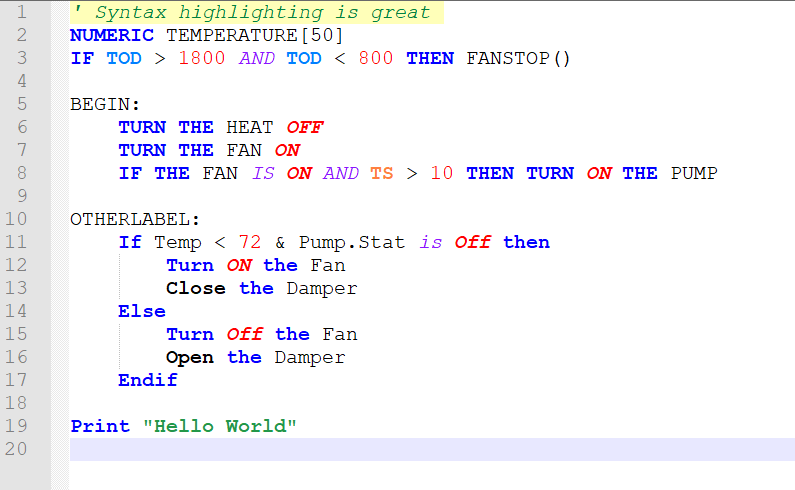

# Andover Plain English Notepad++ Syntax Highlighting

Syntax Highlighting for Andover Plain English Language programs

## Installation

The easiest way to install is to use the User Defined Language GUI.
First download either the light theme (`andover_plain_english_light.xml`)
or the dark theme (`andover_plain_english_dark.xml`) from this
repository. You can do this via the *Releases* page in GitHub
[here](https://github.com/mitchpaulus/andover-plain-english-udl/releases).
Using the menus, go to *Language > Define your language... > Import*.
Find the file you downloaded, and open it. You can import both files if
you would like to have access to both themes.

Close and restart Notepad++. When you open it back up, you should see
either *andover plain english (light)* or *andover plain english (dark)*
underneath *Define your language* depending on which file(s) you
imported. Select the theme you want and you should see your file
highlighted!

## Associated File Extension

I'm not sure that I've come across a global standard extension for these
files. I've chosen *.and* (for Andover) to be the general extension for
files in this language. If the file ends with *.and*, it should
automatically be highlighted with the logic in this file. If you prefer
a different default extension, it is easy to change in the User Defined
Language editor (it's at the top to the right of the *Import...* and
*Export* buttons).

